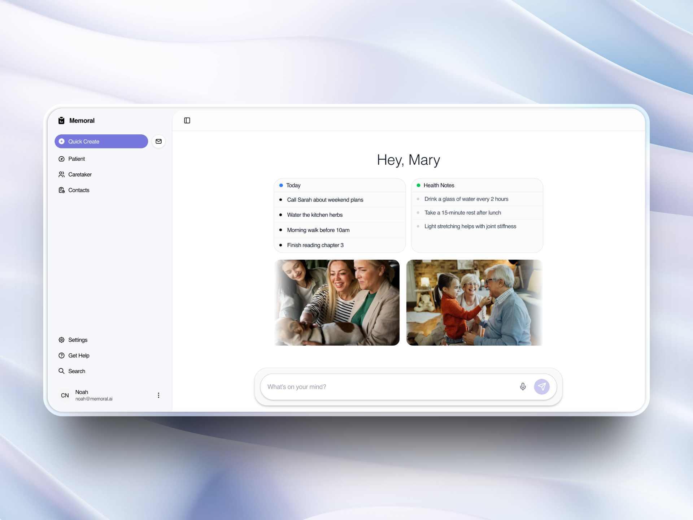

# Memoral - Dementia Companion AI System

A sophisticated multi-agent AI system designed to assist Alzheimer's and dementia patients with daily tasks, health tracking, memory recall, and compassionate conversation. Built for GreatUniHack2025.



## Table of Contents

- [About This Project](#about-this-project)
- [Key Features](#key-features)
- [Architecture](#architecture)
- [Getting Started](#getting-started)
  - [Prerequisites](#prerequisites)
  - [Installation](#installation)
- [Project Structure](#project-structure)
- [Usage](#usage)
- [API Endpoints](#api-endpoints)
- [Development](#development)
- [Documentation](#documentation)
- [Acknowledgements](#acknowledgements)

## About This Project

**Memoral** is an intelligent companion system that leverages cutting-edge AI technology to support individuals living with Alzheimer's and dementia. The system provides a compassionate, user-friendly interface that helps patients with:

- **Memory Recall**: Photo-based memory assistance to help patients remember loved ones and important moments
- **Daily Task Management**: Simple activity tracking and reminders
- **Health Monitoring**: Symptom tracking and medication adherence (for caretakers)
- **Natural Conversation**: AI-powered chat interface that adapts to the patient's needs

The system features **two distinct workflows**:
- **Patient Workflow** (`/dashboard`): Simplified interface for dementia patients with photo memories and daily activities
- **Caretaker Workflow** (`/dashboard/caretaker`): Comprehensive medical oversight for healthcare professionals and family members

Built with **LangGraph** for multi-agent orchestration and **CopilotKit** for natural language interaction, Memoral provides a seamless, empathetic experience that respects the unique needs of individuals with cognitive impairments.

## Key Features

### 🤖 Multi-Agent AI System
- **Memory Agent**: Provides compassionate, context-aware responses using patient profiles and conversation history
- **Supervisor Agent**: Intelligent routing system that directs conversations to specialized agents
- **Task Agent**: Manages daily activities, medication reminders, and task completion tracking
- **Health Agent**: Extracts and tracks health symptoms with severity classification

### 💬 Conversational Interface
- **CopilotKit Integration**: Natural language chat interface with sidebar
- **Context-Aware Responses**: AI remembers previous conversations and patient information
- **Dual Workflows**: Separate interfaces optimized for patients and caretakers

### 📸 Photo Memory System
- **Memory Recall**: Photo-based memory assistance with descriptions
- **Family Recognition**: Helps patients remember loved ones through visual cues
- **Emotional Connection**: Maintains relationships through shared memories

### 📋 Task Management
- **Daily Activities**: Simple to-do list for patients
- **Medication Reminders**: Automated scheduling and adherence tracking
- **Interactive UI**: Checkbox completion and task deletion

### 🏥 Health Tracking
- **Symptom Detection**: Automatic extraction of health concerns from natural language
- **Severity Classification**: Categorizes symptoms as low/medium/high priority
- **Medical Notes**: Persistent health tracking for caretaker review

### 🗄️ Database Integration
- **SQLite Database**: Persistent storage for all patient data
- **Real-time Updates**: UI components sync with database changes
- **Data Separation**: Patient and caretaker data stored separately

### 🔊 Text-to-Speech
- **ElevenLabs Integration**: Natural-sounding voice responses
- **Accessibility**: Audio output for patients who prefer voice interaction

## Architecture

### System Overview

```
┌─────────────────────────────────────────────────────────────┐
│                      User Interface (React)                  │
│  ┌────────────┬──────────────┬───────────────┬────────────┐ │
│  │  Profile   │  Task List   │  Memory Log   │  Health    │ │
│  │   Card     │   Component  │   Component   │   Notes    │ │
│  └────────────┴──────────────┴───────────────┴────────────┘ │
│                                                               │
│                   CopilotKit Chat Interface                  │
└───────────────────────────┬─────────────────────────────────┘
                            │
                            ▼
┌─────────────────────────────────────────────────────────────┐
│              CopilotKit Runtime API                          │
│  Actions: createTask | checkHealth | getPatientInfo         │
└───────────────────────────┬─────────────────────────────────┘
                            │
                            ▼
┌─────────────────────────────────────────────────────────────┐
│                   LangGraph Multi-Agent System               │
│                                                               │
│   ┌──────────────┐        ┌──────────────┐                  │
│   │    START     │───────▶│Memory Agent  │                  │
│   └──────────────┘        └──────┬───────┘                  │
│                                   │                           │
│                                   ▼                           │
│                          ┌─────────────────┐                 │
│                          │Supervisor Agent │                 │
│                          └────────┬─────────┘                │
│                                   │                           │
│                    ┌──────────────┼──────────────┐           │
│                    │              │              │           │
│                    ▼              ▼              ▼           │
│             ┌────────────┐ ┌───────────┐ ┌──────────┐      │
│             │Task Agent  │ │Health     │ │Memory    │      │
│             │            │ │Agent      │ │Response  │      │
│             └─────┬──────┘ └─────┬─────┘ └─────┬────┘      │
│                   │              │             │            │
│                   └──────────────┼─────────────┘            │
│                                  ▼                           │
│                            ┌──────────┐                      │
│                            │   END    │                      │
│                            └──────────┘                      │
└─────────────────────────────────────────────────────────────┘
                            │
                            ▼
┌─────────────────────────────────────────────────────────────┐
│                   SQLite Database                            │
│  patients | medications | tasks | health_notes |            │
│  memory_logs | daily_activities | memory_photos             │
└─────────────────────────────────────────────────────────────┘
```

### Technology Stack

- **Framework**: Next.js 16 (React 19)
- **AI Orchestration**: LangGraph (@langchain/langgraph)
- **Chat Interface**: CopilotKit (@copilotkit/react-core)
- **Language Model**: OpenAI GPT-4o / GPT-4o-mini
- **Database**: SQLite (better-sqlite3)
- **Text-to-Speech**: ElevenLabs API
- **Styling**: TailwindCSS 4
- **Type Safety**: TypeScript 5 + Zod
- **UI Components**: Radix UI
- **State Management**: Jotai, React Context

### Agent Flow

1. **User Input** → Enters through CopilotKit chat interface
2. **Memory Agent** → Processes input with patient context and conversation history
3. **Supervisor Agent** → Classifies intent and routes to appropriate agent:
   - `"task"` → Task Agent (for reminders, activities)
   - `"health"` → Health Agent (for symptoms, concerns)
   - `"memory"` → Returns conversation response
4. **Specialized Agent** → Processes request and updates database
5. **UI Updates** → React Context propagates changes to components in real-time

## Getting Started

### Prerequisites

Before you begin, ensure you have the following installed:

- **Node.js** 18 or higher ([Download](https://nodejs.org/))
- **npm** or **bun** package manager
- **OpenAI API Key** ([Get one here](https://platform.openai.com/api-keys))
- **ElevenLabs API Key** (optional, for text-to-speech) ([Get one here](https://elevenlabs.io/))

### Installation

1. **Clone the repository**
   ```bash
   git clone <repository-url>
   cd GreatUniHack2025
   ```

2. **Navigate to the front-end directory**
   ```bash
   cd front-end
   ```

3. **Install dependencies**
   ```bash
   npm install
   # or
   bun install
   ```

4. **Set up environment variables**
   
   Create a `.env.local` file in the `front-end` directory:
   ```bash
   # Required
   OPENAI_API_KEY=sk-your-openai-api-key-here
   NEXT_PUBLIC_BASE_URL=http://localhost:3000
   
   # Optional (for text-to-speech)
   ELEVENLABS_API_KEY=your-elevenlabs-api-key-here
   ```

5. **Initialize the database**
   ```bash
   npm run db:init
   ```
   
   This creates the SQLite database at `data/patients.db` with all required tables.

6. **Start the development server**
   ```bash
   npm run dev
   ```

7. **Open your browser**
   
   Navigate to [http://localhost:3000](http://localhost:3000) to see the application.

   - **Patient Dashboard**: [http://localhost:3000/dashboard](http://localhost:3000/dashboard)
   - **Caretaker Dashboard**: [http://localhost:3000/dashboard/caretaker](http://localhost:3000/dashboard/caretaker)

## Project Structure

```
GreatUniHack2025/
├── front-end/
│   ├── app/
│   │   ├── api/
│   │   │   ├── agent/              # LangGraph endpoint
│   │   │   ├── copilotkit/         # CopilotKit runtime
│   │   │   ├── db/                 # Database API routes
│   │   │   ├── mcp/                # MCP tools endpoint
│   │   │   └── text-to-speech/     # ElevenLabs TTS
│   │   ├── dashboard/
│   │   │   ├── page.tsx            # Patient dashboard
│   │   │   └── caretaker/
│   │   │       └── page.tsx        # Caretaker dashboard
│   │   ├── contacts/
│   │   │   └── page.tsx            # Contacts page
│   │   ├── layout.tsx              # Root layout
│   │   └── page.tsx                # Landing page
│   ├── components/
│   │   ├── ui/                     # Reusable UI components
│   │   ├── patient-profile-card.tsx
│   │   ├── task-list.tsx
│   │   ├── memory-log-card.tsx
│   │   ├── health-notes-card.tsx
│   │   └── ...
│   ├── lib/
│   │   ├── db/
│   │   │   ├── schema.ts           # Database schema
│   │   │   ├── index.ts            # Database operations
│   │   │   └── init.ts             # Database initialization
│   │   ├── graph/
│   │   │   ├── index.ts            # Graph compilation
│   │   │   ├── patient-graph.ts    # Patient workflow
│   │   │   ├── caretaker-graph.ts  # Caretaker workflow
│   │   │   └── nodes/
│   │   │       ├── patient/        # Patient agents
│   │   │       └── caretaker/      # Caretaker agents
│   │   ├── mcp/
│   │   │   ├── client.ts           # MCP client
│   │   │   └── tools.ts            # MCP tools
│   │   ├── state-context.tsx       # Patient state
│   │   ├── task-context.tsx        # Task state
│   │   └── types.ts                # TypeScript types
│   ├── data/
│   │   └── patients.db             # SQLite database (gitignored)
│   ├── public/                     # Static assets
│   └── package.json
└── README.md
```

### Development Tips

- The database is automatically initialized when running `npm run dev`
- Database file location: `front-end/data/patients.db` (gitignored)
- Check browser console for agent processing logs
- Use React DevTools to inspect state updates

## Documentation

For detailed documentation, see the following files in the `front-end` directory:

- **[QUICK_START.md](front-end/QUICK_START.md)** - 5-minute setup guide
- **[ARCHITECTURE.md](front-end/ARCHITECTURE.md)** - Complete system architecture
- **[DATABASE.md](front-end/DATABASE.md)** - Database schema and operations
- **[INTEGRATION.md](front-end/INTEGRATION.md)** - CopilotKit integration details
- **[PATIENT_WORKFLOW.md](front-end/PATIENT_WORKFLOW.md)** - Patient workflow documentation
- **[CARETAKER_WORKFLOW.md](front-end/CARETAKER_WORKFLOW.md)** - Caretaker workflow documentation
- **[WORKFLOWS_SUMMARY.md](front-end/WORKFLOWS_SUMMARY.md)** - Comparison of workflows

## Acknowledgements

This project utilizes the *ElevenLabs* API for speech and text-to-speech capabilities.
