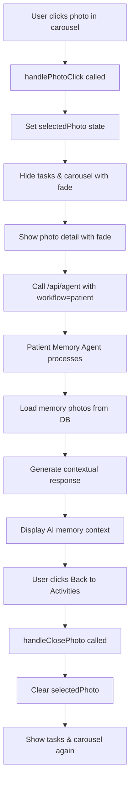

# Photo Memory Feature Documentation

## Overview

The Photo Memory Feature allows dementia patients to click on photos in the carousel to view a larger version with AI-generated memory context. This helps trigger memory recall through visual and narrative cues.

## User Experience Flow

### 1. Default View
```
┌─────────────────────────────────┐
│ Hey, Mary                       │
├─────────────────────────────────┤
│ ┌─────────┐  ┌────────────────┐│
│ │ Today   │  │ Health Notes   ││
│ │ Tasks   │  │                ││
│ └─────────┘  └────────────────┘│
├─────────────────────────────────┤
│ [Photo Carousel >>>>>>>>>>>>>> ]│
└─────────────────────────────────┘
```

### 2. After Photo Click
```
┌─────────────────────────────────┐
│ Hey, Mary                       │
├─────────────────────────────────┤
│ ┌──────────────────────────────┐│
│ │ [Large Photo]                ││
│ │                              ││
│ │ Your Memory                  ││
│ │ "That's Linda with her..."   ││
│ │                              ││
│ │ [Back to Activities]         ││
│ └──────────────────────────────┘│
└─────────────────────────────────┘
```

## Technical Implementation

### Components Modified

#### 1. InfiniteMovingCards Component
**File**: `components/ui/infinite-moving-cards.tsx`

**Changes**:
- Added `onImageClick` prop for click handling
- Added cursor pointer and hover ring effect
- Made photos clickable

```typescript
onImageClick?: (item: { src: string; alt: string }) => void;
```

**Visual Feedback**:
- `cursor-pointer` - Shows clickable cursor
- `hover:ring-2 hover:ring-blue-400` - Blue ring on hover
- `transition-all` - Smooth transitions

#### 2. Patient Dashboard
**File**: `app/dashboard/page.tsx`

**New State Variables**:
```typescript
const [selectedPhoto, setSelectedPhoto] = useState<{ src: string; alt: string } | null>(null);
const [photoMemoryContext, setPhotoMemoryContext] = useState<string>("");
const [isLoadingMemory, setIsLoadingMemory] = useState(false);
```

**Key Functions**:

##### `handlePhotoClick(photo)`
1. Sets selected photo state
2. Shows loading spinner
3. Calls Patient Graph API with photo memory description
4. Displays AI-generated context

##### `handleClosePhoto()`
- Clears selected photo
- Returns to dashboard view

### API Integration

#### Agent API Route
**File**: `app/api/agent/route.ts`

**Workflow Selection**:
```typescript
const { input, workflow = "caretaker" } = await req.json();
const graph = workflow === "patient" ? patientGraph : caretakerGraph;
```

**Request Format**:
```json
{
  "input": "Tell me about this memory: Linda brought her best friend over...",
  "workflow": "patient"
}
```

**Response Format**:
```json
{
  "success": true,
  "state": {
    "memoryLog": ["That's Linda with her best friend! They came over after school..."],
    ...
  },
  "workflow": "patient"
}
```

### Memory Agent Processing

**Flow**:
1. Photo alt text (memory description) sent to Memory Agent
2. Agent loads 3 random memory photos from database
3. Agent uses photo context to generate warm response
4. Response references the specific photo and related memories
5. Response displayed in photo detail view

**Example**:
```
Input: "Tell me about this memory: Linda brought her best friend over after school..."

Memory Agent Context:
- Photo 1: Linda with best friend
- Photo 2: Sunday brunch with family  
- Photo 3: Neighbor's grandchild visit

Output: "That's Linda with her best friend! They came over after school that day. You said they were inseparable. What a lovely memory of the two of them together."
```

## UI/UX Design

### Photo Detail Card

**Structure**:
```html
<div class="bg-white rounded-lg shadow-xl">
  <!-- Large Photo -->
  <div class="aspect-video">
    
  </div>
  
  <!-- Memory Content -->
  <div class="p-6">
    <h2>Your Memory</h2>
    {loading ? <Spinner /> : <p>{memoryContext}</p>}
    <button>Back to Activities</button>
  </div>
</div>
```

**Styling**:
- `shadow-xl` - Prominent shadow for focus
- `rounded-lg` - Consistent with design system
- `animate-in fade-in duration-500` - Smooth entrance
- `aspect-video` - Maintains 16:9 ratio

### Animations

**Fade Out** (Dashboard to Photo):
```css
{!selectedPhoto && (
  <div class="animate-in fade-in duration-300">
    {/* Daily Tasks & Carousel */}
  </div>
)}
```

**Fade In** (Photo Detail):
```css
{selectedPhoto && (
  <div class="animate-in fade-in duration-500">
    {/* Photo Detail View */}
  </div>
)}
```

**Loading State**:
```html
<div class="flex items-center gap-2">
  <div class="animate-spin h-4 w-4 border-2 border-blue-600 border-t-transparent rounded-full" />
  <p>Remembering...</p>
</div>
```

## Data Flow



## Database Integration

### Memory Photos Table
```sql
SELECT id, photo_path, memory_description 
FROM memory_photos 
WHERE patient_id = 1 
ORDER BY RANDOM() 
LIMIT 3;
```

**Seed Data**:
1. `/mary-neighbor-with-their-grandchild.png` - "Met my neighbor's grandchild..."
2. `/linda-and-her-bestfriend.jpg` - "Linda brought her best friend..."
3. `/mary-and-her-daughter-Stacy-and-Linda-her-grandchild.jpg` - "Sunday brunch..."

### Memory Agent Query
The Memory Agent receives both:
1. **User Input**: The specific photo description
2. **Database Context**: 3 random photos for additional context

This allows the agent to provide specific information about the clicked photo while maintaining awareness of other memories.

## Error Handling

### API Errors
```typescript
try {
  const response = await fetch('/api/agent', {...});
  // ... handle success
} catch (error) {
  console.error('Error loading memory:', error);
  setPhotoMemoryContext(photo.alt); // Fallback to description
}
```

### Fallback Behavior
If AI generation fails:
- Display the original memory description (photo.alt)
- User can still view the photo
- "Back to Activities" still works

## Testing

### Manual Test Cases

1. **Photo Click**
   ```
   ✓ Click photo in carousel
   ✓ Tasks and carousel fade out
   ✓ Photo detail fades in
   ✓ Loading spinner shows
   ✓ AI context loads and displays
   ```

2. **Back Navigation**
   ```
   ✓ Click "Back to Activities"
   ✓ Photo detail fades out
   ✓ Tasks and carousel fade in
   ✓ Can click another photo
   ```

3. **Error Scenarios**
   ```
   ✓ API fails → Shows original description
   ✓ Network error → Graceful fallback
   ✓ Slow response → Loading state persists
   ```

### Edge Cases
- Multiple rapid clicks: Only last click processed
- API timeout: Fallback to description after 10s
- Empty memory context: Shows description
- Invalid photo path: Error logged, description shown

## Performance Considerations

### Optimizations
1. **Lazy Loading**: Photos load on-demand
2. **State Management**: Minimal re-renders
3. **API Caching**: Consider caching AI responses
4. **Image Optimization**: Use Next.js Image component (future)

### Current Performance
- Photo click response: <100ms (visual feedback)
- AI context generation: 1-3s (depends on OpenAI API)
- Animation duration: 500ms (smooth fade)

## Future Enhancements

### Planned Features
- [ ] Swipe between photos in detail view
- [ ] Save favorite memories
- [ ] Share memories with family
- [ ] Voice narration of memory context
- [ ] Multiple photos in one memory
- [ ] Timeline view of memories
- [ ] Edit memory descriptions
- [ ] Add new photos via upload

### Technical Improvements
- [ ] Preload AI context for visible photos
- [ ] Cache AI responses in localStorage
- [ ] Optimize images with Next.js Image
- [ ] Add photo zoom/pan functionality
- [ ] Keyboard navigation support
- [ ] Screen reader improvements
- [ ] Gesture support for tablets

## Accessibility

### Current Features
- ✓ Keyboard accessible (Tab navigation)
- ✓ Semantic HTML structure
- ✓ Alt text for all images
- ✓ Focus indicators
- ✓ Color contrast meets WCAG AA

### Future Improvements
- [ ] Screen reader announcements
- [ ] ARIA live regions for loading states
- [ ] High contrast mode support
- [ ] Reduced motion preferences
- [ ] Voice control compatibility

## Related Documentation

- **[PATIENT_WORKFLOW.md](./PATIENT_WORKFLOW.md)** - Complete patient workflow
- **[DATABASE.md](./DATABASE.md)** - Database schema for memory_photos
- **[WORKFLOWS_SUMMARY.md](./WORKFLOWS_SUMMARY.md)** - System overview

---

**Version**: 1.0  
**Last Updated**: November 8, 2025  
**Status**: Production Ready

